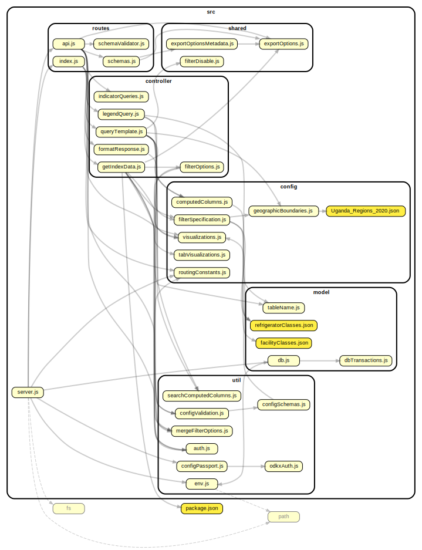

# CCIS-Dashboard

## Production deployment with Docker
1. Install [Docker](https://docs.docker.com/get-docker/) and [git](https://git-scm.com/downloads)
2. Clone this repository and `cd` into it
3. Get a [Mapbox token](#mapbox-api)
4. Setup your `.env` file ([instructions below](#environment-variables))
5. Build the docker container
```
docker build -t ccis-dashboard .
```
6. Start the application, replacing `80` with the port where the application should be available
```
docker run -p 80:8000 ccis-dashboard
```
7. Application should now be available from outside the docker container at `localhost:80`. Setup a webserver (e.g. nginx) to expose the application to the internet

## Mapbox API
To use the Mapbox API, you must have an API key. The API key is used as an identifier for billing purposes. To create a Mabox API Key, first make a [Mapbox account](https://www.mapbox.com/), then [generate a new one](https://docs.mapbox.com/help/glossary/access-token/) or use your default public token.

Once the key is created, place it in a `.env` file as specified below.

## Environment Variables
Create a file named `.env` in the top level, and fill in the following fields
for your deployment.
```
DB_SERVER=
DB_NAME=
DB_USER=
DB_PASS=
MAPBOX_API_TOKEN=
COOKIE_KEY=
ODKX_AUTH_URL=
ODKX_TEST_USER=
ODKX_TEST_PASSWORD=
```
* `DB_SERVER` is the URL of a Microsoft T-SQL server
* `DB_NAME` is the name of a database on that server
* `DB_USER` and `DB_PASS` are the login credentials for a (read-only) user on that database
* `MAPBOX_API_TOKEN` is the token generated above
* `COOKIE_KEY` should be newly-generated, a strong random secret which is used to encrypt authentication details
* `ODKX_AUTH_URL` is the URL of an ODK-X sync endpoint
* `ODKX_TEST_USER` and `ODKX_TEST_PASSWORD` are only required for testing. These are credentials for a user on that ODK-X server

## Development installation
Clone the repository and `cd` into it. Set up your `.env` file.\
From there run:
```
npm install
npm run build
npm start
```
The dashboard will be available at localhost:8000 \
You can log in to the dashboard using any user from the connected ODK-X server.\
To exit, type `Ctrl+C` in the terminal

## Testing
The dashboard has a suite of tests in the `__tests__` folder. Some of these run
in the Firefox browser, and some of them use a local test database configured
with Docker. To run the tests, you'll need to install these dependencies.
1. Confirm that you have a `.env` file in the top level of the project.
2. [Install docker](https://docs.docker.com/get-docker/) (this is used by the `pretest` step to run a local Microsoft SQL server)
3. [Install docker-compose](https://docs.docker.com/compose/install/) if not installed by step 1
4. Install firefox
5. From the directory of this repository, run `npm install`
6. Run `npm test`

To run a single test file:
1. Run `sudo docker-compose up`, or just `docker-compose up` depending on your user permissions. This starts a local Microsoft SQL server. Note: you must only have one local SQL server running at a time. This step is only necessary for some test files; if your tests pass without it, it is not necessary.
2. Run `npx jest __tests__/<name of test file>` (the `npx` command is part of npm, and jest is the test environment we use)

Notes for Windows:
* If you run into an issue with your BIOS, check out this [SO post](https://stackoverflow.com/questions/39684974/docker-for-windows-error-hardware-assisted-virtualization-and-data-execution-p/39989990#39989990)

## Style Guidelines
Current code uses the following style
* Use `require` instead of `import`
* When defining objects with `{ }`, put spaces inside the braces like `{ logIn }`
* Single quotes `''` for javascript, double quotes `""` for html
* In comments, put a space after the `//`

## Architecture
The following dependency graphs describe the internal structure of the files
here.

The server-side:



The client-side:


To update these images, make sure you have graphviz installed (we need the `dot` command) and run `npm run dependency-graph`
