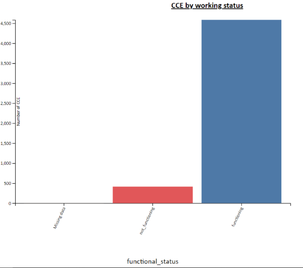
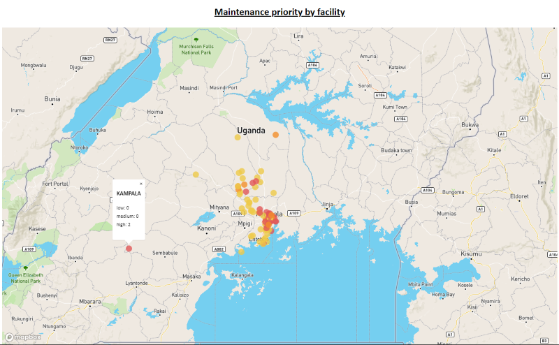
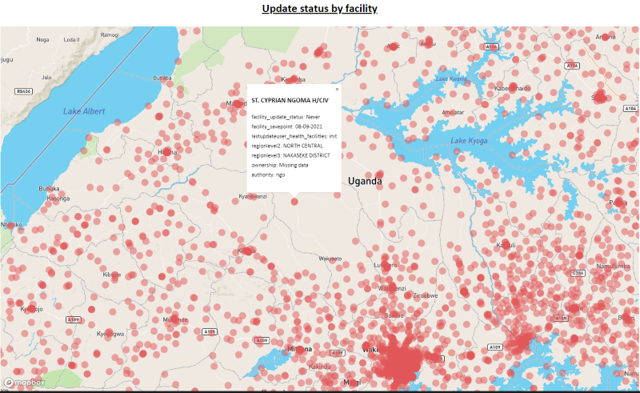
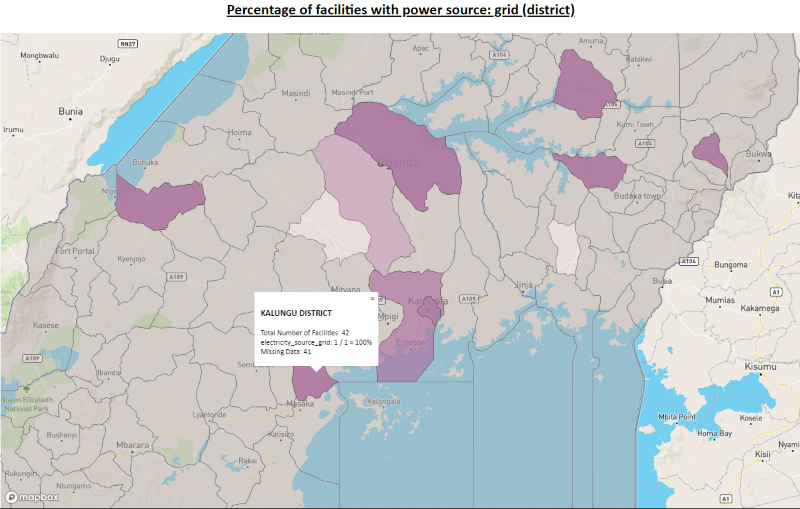

# Guide to Visualizations in CCIS

The goal of this living document is provide a clear picture of how to use our "visualization model" to create new ones or modify exisiting ones. 

All visualizations must be defined in `src/config/visualizations.js`. The form of this file is a mapping from a visualizations name (e.g. 'Working status by CCE model') to its corresponding configuration object, e.g.

```
{
    type: 'refrigerator',
    groupBy: 'model_id',
    colorBy: 'functional_status',
    colorMap: {
        'functioning': 'blue',
        'not_functioning': 'red',
        'Missing data': 'gray'
    },
    style: 'bar'
}
```
We will later go into more detail about each of these properties.

To begin, there are four types of visualizations supported by the dashboard:
 - 'pie': pie chart
 - 'bar': stacked bar charts
 - 'map': map with markers at facility locations that can be expanded into popups
 - 'heatmap': map with regions shaded in by proportion or quantity

Every visualization **must** have a `style` property that corresponds to one of these four options. Each of these will have other necessary properties that must be included in the configuration.

## A Note on Columns
Visualizations are dependent on chosen columns from the database model. Each of these must be included in `src/model/tableName.js` as a mapping from column name to the corresponding table (e.g. `model_id: 'refrigerator_types_odkx'` because `model_id` is a column in `refrigerator_types_odkx`).

Beyond those taken straight from the database tables, we also allow you to define your own SQL in what we call "computed columns". These come from `src/config/computedColumns.js`. Let's take a look at an example:

```
{
    name: 'BucketedRefrigeratorUpdate',
    query: `SELECT id_refrigerators,
        TO_CHAR(CAST(savepointtimestamp_refrigerators as timestamp), 'Month') as updatemonth_refrigerators
        FROM refrigerators_odkx`,
    provides: [ 'updatemonth_refrigerators' ],
    joinOn: {
        table: 'refrigerators_odkx',
        localColumn: 'id_refrigerators',
        foreignColumn: 'id_refrigerators'
    }
}
```
In this case, we need to know the update month for refrigerators so that we can use it in a visualization. This is not provided directly in the tables, but the overall timestamp is. Thus, we wrote some SQL that turned the timestamp into just a month. This goes with the `query` property. Because this provides the `updatemonth_refrigerators` column, it is included in the `provides` property (which is a list). Now, you can use the `updatemonth_refrigerators` column name anywhere a column is necessary, and the generated SQL will include our custom `query` to create this column.

Additionally, we need to describe how to join this custom column onto our tables. This is the `joinOn` property, which must include of a `table`, `localColumn`, and `foreignColumn`. The `localColumn` is the name of the column from your custom query. The `foreignColumn` is the column name to join on for that specified table. In this case, we want to join on refrigerators, so we use the `id_refrigerators` column in each. This will do an *inner join* on these columns. Because this is an inner join, computed columns can be used for to define custom filters on our data. If a row does not make it past the `WHERE` clause of our custom SQL, it will not be joined, removing it from the resulting dataset.

**Note:** Every value in `provides` and the value for `localColumn` must be in the select clause of your query.

## "refrigerator" vs. "facility" type
Beyond the style of chart, each visualization should also have a `type`, which has two options: 'refrigerator' or 'facility'. The primary purpose of this is to determine whether the visualization is counting/measuring facilities or refrigerators.

One visualization that we have is a bar chart measuring the facilities by update month. Because the height of the bars is based on the count of facilities, we have `type: 'facility'`. On the other hand, we have a pie chart counting refrigerators by their working status. Because the size of the slices is based on the count of refrigerators, we have `type: 'refrigerator'`. This type is tied to the logical unit that you are counting from the dataset.

## Pie Charts
The simplest visualization type is the pie chart. If a visualization's `style` == `pie`, there is just one additional necessary property: `colorBy`. This **must** be a column (as described above). For each option of this column, the count of rows with that option will correspond to the size of the pie chart. Let's take a look at an example:

```
'CCE by working status (pie)': {
    type: 'refrigerator',
    colorBy: 'functional_status',
    colorMap: {
        'functioning': 'blue',
        'not_functioning': 'red',
        'Missing data': 'gray'
    },
    style: 'pie'
}
```
This specification also has the optional property `colorMap`. If you know what the slices will be, you can predefine their colors. Colors for unassigned slices are going to be arbitrary. 

This produces the following visualization:


Because we have three possible options for `functional_status` ("not_functioning", "functioning", or "Missing data"), there is a slice for each, although the "Missing data" slice is too small to notice. The sizes are proportional to the number of refrigerators of that status. Additionally, the colors follow those assigned in our specification.

An additional option is to include a `sort` property that must be "ASC" or "DESC". This will sort the pie slices by their size.

See "A Note on Legends" for additional config options surrounding the legend.

## Bar Charts
The next simplest visualization is the bar chart. These have two additional required properties: `colorBy` and `groupBy`. `groupBy` must be a column and defines how bars are separated. These are separated into what we call "bar groups". `colorBy` must also be a column and defines how a single "bar group" is separated into several "stacked bars" of different colors. Let's take a look at an example:
```
'CCE by working status': {
    type: 'refrigerator',
    groupBy: 'functional_status',
    colorBy: 'functional_status',
    colorMap: {
        'functioning': 'blue',
        'not_functioning': 'red',
        'Missing data': 'gray'
    },
    style: 'bar'
},
```
Here, we also see the optional propety `colorMap` that defines a mapping from `colorBy` options to their corresponding colors. Much like above, a refrigerator can have a working status of "functioning", "not_functioning", or be missing data.

Additionally, we can notice that our `groupBy` and `colorBy` are the same. Because bars are grouped before being stacked into different colors, this means that each "bar group" will only have one color (as there is only one `colorBy` option in each bar group). This is a common design pattern for creating bar charts that do not appear to be stacked. Let's see what this produces:



Because `groupBy` and `colorBy` are the same, we do not create a legend as the x-axis labels serve that purpose. This chart provides the same information as our pie chart example but through a much different visual.

Let's look at a similar example where `groupBy` and `colorBy` are not the same:
```
'Working status by CCE model': {
    type: 'refrigerator',
    groupBy: 'model_id',
    colorBy: 'functional_status',
    colorMap: {
        'functioning': 'blue',
        'not_functioning': 'red',
        'Missing data': 'gray'
    },
    style: 'bar'
}
```
Here, `groupBy` has been changed to be `model_id`. This means that we expect a "bar group" for each `model_id` present in our dataset. This bar group will then consist of stacked bars for each functional status of that model. Let's take a look:


Now that each bar group is not just one color, we include a legend.

Whereas pie charts can only be used to quantify one piece of information (one column), bar charts can be used for two. Given two columns, the placement of one as `groupBy` and the other as `colorBy` will have a big effect on the chart and should be chosen carefully.

## A Note on Legends
Both pie charts and bar charts have legends for their colors (except for bar charts where `groupBy` and `colorBy` are the same). We can specify additional properties of the legend for greater control on a visualization-by-visualization basis. Let's look at our options:
- `disableLegend`: if true, no legend will be displayed.
- `legendNonzeroOnly`: if true, our legend will only assign and display colors for options of the `colorBy` column that were nonZero.
- `legendOrder`: you can provide an array of strings to configure the order that options are displayed in the legend. Any options not included within this order will be appended arbitrarily to the end.

Some visualizations, like those with `model_id` as `colorBy`, have long legends with mostly zero options. This is an example of why we might want to set the legend to display nonzero options only.

## Sum Instead of Count
By default, pie charts and bar charts use counts. We provide the alternative of instead summing some column to determine the "value" (height of bar, size of slice). To do this, add the `sum` property, which should be mapped to the column that you want to sum. This column must be able to be cast to an integer. 

An example use case is for counting alarms. Each row in our database can report multiple alarms. Because of this, it is not enough to count the rows that represent alarms as that does not accurately represent the count. Instead, we need to add the count of alarms from each. This feature allows us to sum the number of alarms and treat that as the "value" for the corresponding refrigerator and facility.

## Maps
The next style of visualization is the map, which is drastically different than the pie or bar chart. This has two additional required properties: `mapType` and `facilityPopup`.

`facilityPopup` contains the information that needs to be used for the popup. It should map columns to one of four options:
- `'BY_FACILITY'`: in this case, this column should be the same for each facility (like the facility's ownership)
- `'COUNT'`: in this case, this will count the number of nonempty rows for that column for each facility
- `'SUM'`: in this case, this will sum this column for each facility. **Note**: column must be able to be cast to an integer
- a list of options for that column, in which case it will count the frequency of each option for this facility.

`mapType` affects specific logic surrounding how the popups and markers are made. When clicking on these markers, a popup will be produced according to `facilityPopup`. If all of the columns within the popup are `'BY_FACILITY'`, `'COUNT'`, or `'SUM'`, you can use `'colored_facilities'` as the mapType. Otherwise, you will have to define your own with custom logic in `src/frontend-src/coordinates.js`. 

Let's take a look at some examples:

### Example 1: Maintenance Priority
The maintentnace priorities map should keep track of the number of low, medium, and high maintenance priority refrigerators at each facility. It is specified as follows:
```
'Maintenance priority by facility': {
    type: 'refrigerator',
    mapType: 'maintenance_priority',
    style: 'map',
    facilityPopup: {
        'maintenance_priority': [ 'high', 'low', 'medium', 'not_applicable' ]
    }
}
```

Here, we describe our maintenance priority as having options of `low`, `medium`, `high`, and `not_applicable`. Because our `mapType` is 'maintenance_priority', we have custom logic for creating these popups, resulting in this:



We have the count of refrigerators at each maintenance priority for the specific facility that is clicked.

### Example 2: Update Status by Facility
Another map is one that measures each facility's update status (how recently they were updated). This map specification contains a bit more information:
```
'Update status by facility': {
    type: 'facility',
    mapType: 'colored_facilities',
    style: 'map',
    colorBy: 'facility_update_status',
    colorMap: {
        'Never': 'red',
        'Stale': 'yellow',
        'Recent': 'green'
    },
    facilityPopup: {
        'facility_update_status': 'BY_FACILITY',
        'facility_savepoint': 'BY_FACILITY',
        'lastupdateuser_health_facilities': 'BY_FACILITY',
        'regionlevel2': 'BY_FACILITY',
        'regionlevel3': 'BY_FACILITY',
        'ownership': 'BY_FACILITY',
        'authority': 'BY_FACILITY'
    }
},
```

We can use the 'colored_facilities' `mapType` because everything in our facility popup is 'BY_FACILITY'. Each thing in `facilityPopup` will be displayed as "column: value".

However, there are two additional optional properties here. One is `colorBy`. This specifies the column (which must be contained in `facilityPopup`) that should be used to color the circles on the map. Next, there is `colorMap`, which maps the options for that column to the corresponding color. For example, if a facility has an update status of 'Stale', it will have a yellow circle. **Note**: these must be used in conjunction with one another. If you use one, you must use the other.

Let's take a look at what that produces:



As it stands, all of our facilities have update statuses of "never" and are red. As can be seen in the popup, we get the value for each column listed in `facilityPopup`.

## Heatmaps
The final type of visualization included in the dashboard is the heatmap. Heatmaps have three additional required columns: `colorBy`, `regionLevel`, and `heatmapType`. `regionLevel` determines the areas that are shaded in and must be on of the options included in `levelNames` from `shapefiles.js`. `colorBy` is the name of the column that will be counted to determine the opacity used for each region. `heatmapType` determines how these items are counted (and how they are colored as a result).

### True / False / Null
The colorBy for a heatmap should **always** be a computed column. In this, each refrigerator/facility (depending on the `type`) row **must** be assigned 'TRUE', 'FALSE', or NULL. If a row is NULL, it will not be factored into the color calculation. 

This colorBy column will be counted to determine the color for each region. The method of counting will be determined by the `heatmapType`, of which there are two options: `proportion` and `quantity`. If the heatmapType is `proportion`, the color is calculated from `COUNT('TRUE') / (COUNT('TRUE') + COUNT('FALSE'))`. In essence, the range of potential values to be colored is [0,1.0]. If the heatmapType is `quantity`, the color for each region will instead just be calculated from `COUNT('TRUE')`. This heatmapType makes no attempt to account for the relative frequency of an occurence and should instead be used when looking for the absolute frequency. The range of potential values is unbounded, and we instead assign the maximum opacity to the maximum count that occurs. If our range of values is [3,37], we will create a linear opacity scale of [0,37] for filling.

Additionally, you have the option of including `fill_specs`. These include a `min_opacity` and `max_opacity` for defining the range of opacity to be used for the heatmap and a `fill_color` for determining the color to be used.

Let's take a look at an example:
```
'Percentage of facilities with power source: grid (region)': {
    type: 'facility',
    style: 'heatmap',
    colorBy: 'electricity_source_grid',
    regionLevel: 'Region (Level 2)',
    fill_specs: {  // Example usage of fill specs using default specs
        min_opacity: 0.1,
        max_opacity: 0.95,
        fill_color: 'purple'
    }
}
```
This heatmap should count the proportion of facilities with grid as a source of their electricity. We are doing this by region (our second geographic level), and each district will be filled in purple with a opacity ranging from 0.1 to 0.95.

As mentioned, this `colorBy` column must be from `computedColumn` and follow the True / False / Null structure. We can take a look here:

```
{
    name: 'ElectricitySourceGrid',
    query: `SELECT id_health_facilities,
        CASE
            WHEN electricity_source IN ('both_grid_and_solar', 'grid', 'both_grid_and_generator', 'all') THEN 'TRUE'
            WHEN electricity_source IS NULL THEN NULL
            WHEN electricity_source = '' THEN NULL
            ELSE 'FALSE'
        END AS electricity_source_grid
        FROM health_facilities2_odkx`,
    provides: [ 'electricity_source_grid' ],
    joinOn: {
        table: 'health_facilities2_odkx',
        localColumn: 'id_health_facilities',
        foreignColumn: 'id_health_facilities'
    }
}
```
As can be seen, we are assigning each health facility TRUE, FALSE, or NULL based on their electricity_source.

These then produce the following map:



Those areas that are completely missing data (i.e. 0 true and 0 false) will be shaded gray. The rest will be part of the purple gradient based on their proportion. Additionally, we can see that the popup includes the fraction described above, the total number of facilities, and the number that are missing data.

## Brief Reference Sheet
For quick reference, these are the options for each style of visualization.
## Pie

```
'visualization name': {
    type: mandatory, 'refrigerator' or 'facility'
    colorBy: mandatory, some column
    colorMap: optional, mapping of options from colorBy column to colors
    style: 'pie'
    sort optional, 'ASC' or 'DESC'
    disableLegend: optional, boolean
    legendNonzeroOnly: optional, boolean
    legendOrder: optional, array of colorBy column options,
    sum: optional, column to sum
}
```

## Bar

```
'visualization name': {
    type: mandatory, 'refrigerator' or 'facility'
    groupBy: mandatory, column to split into bar groups
    colorBy: mandatory, column to split bar groups into stacked bars
    colorMap: optional, mapping of options from colorBy column to colors
    style: 'bar'
    sort: optional, 'ASC' or 'DESC'
    disableLegend: optional, boolean
    legendNonzeroOnly: optional, boolean
    legendOrder: optional, array of colorBy column options,
    sum: optional, column to sum
}
```

## Map

```
'visualization name': {
    type: mandatory, 'refrigerator' or 'facility'
    mapType: mandatory, see map section for description
    colorBy: optional, column to color markers by (only for mapType = 'colored_facilities')
    colorMap: optional, mapping of colorBy column options to colors (only for mapType = 'colored_facilities')
    style: 'map'
    facilityPopup: mandatory, see map section for description
}
```

## Heatmap

```
'visualization name': {
    type: mandatory, 'refrigerator' or 'facility'
    heatmapType: mandatory, 'proportion' or 'quantity'
    style: 'heatmap',
    colorBy: mandatory, column used to determine opacity (must follow TRUE/FALSE/NULL)
    regionLevel: mandatory, regions to shade, must be included in shapefiles.levelName
    fill_specs: optional, see format in heatmap section
}
```
